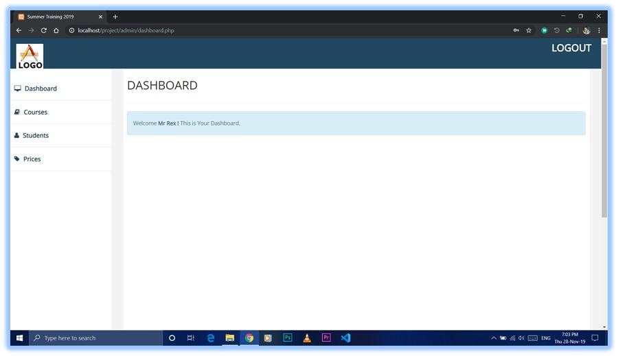
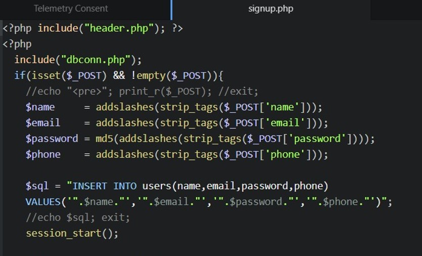
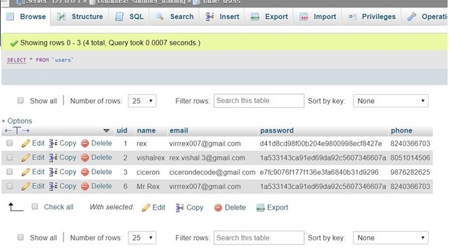
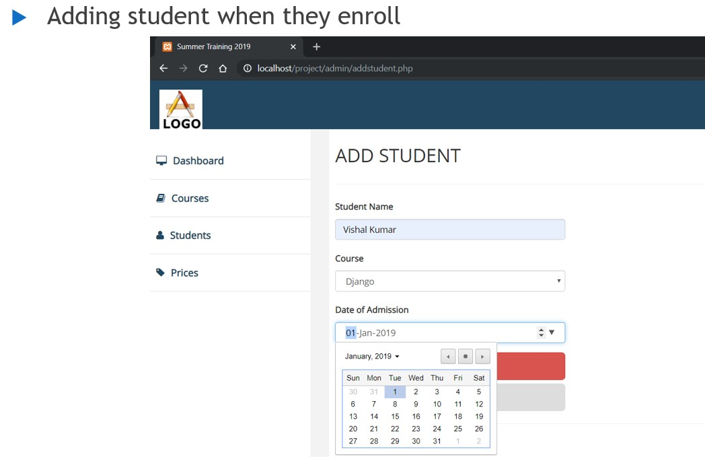
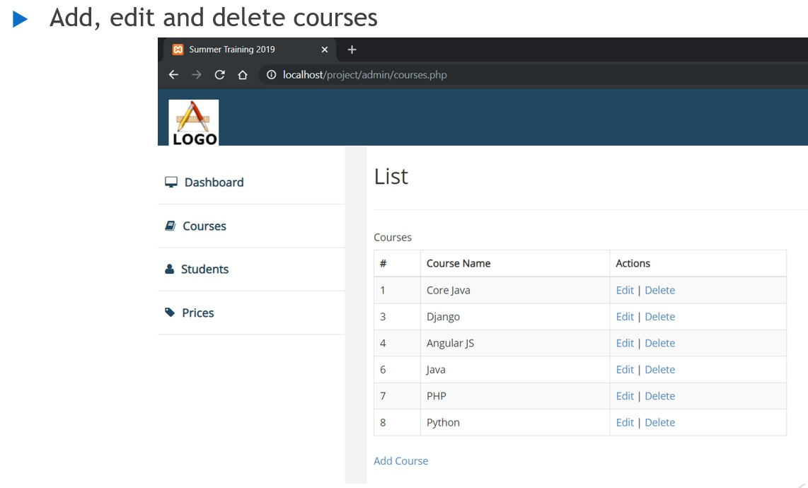
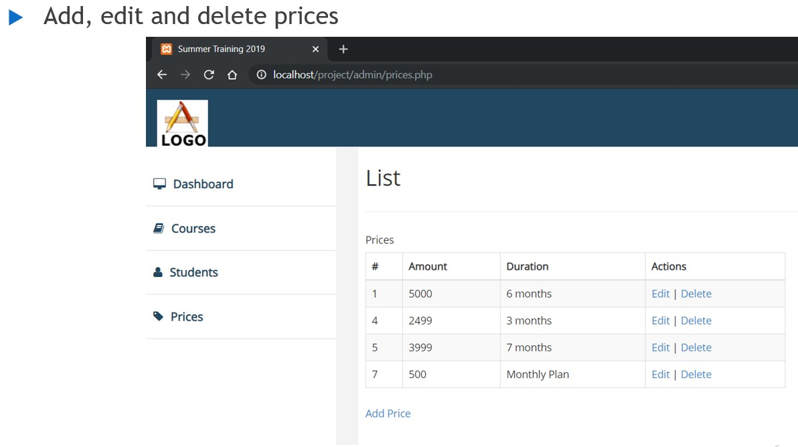
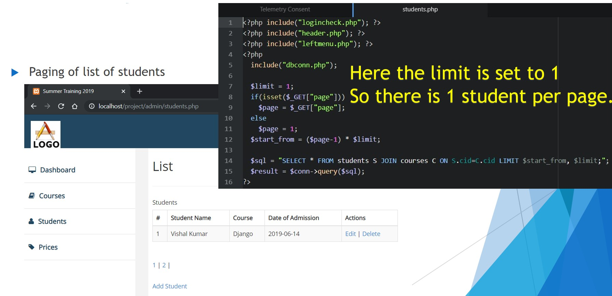
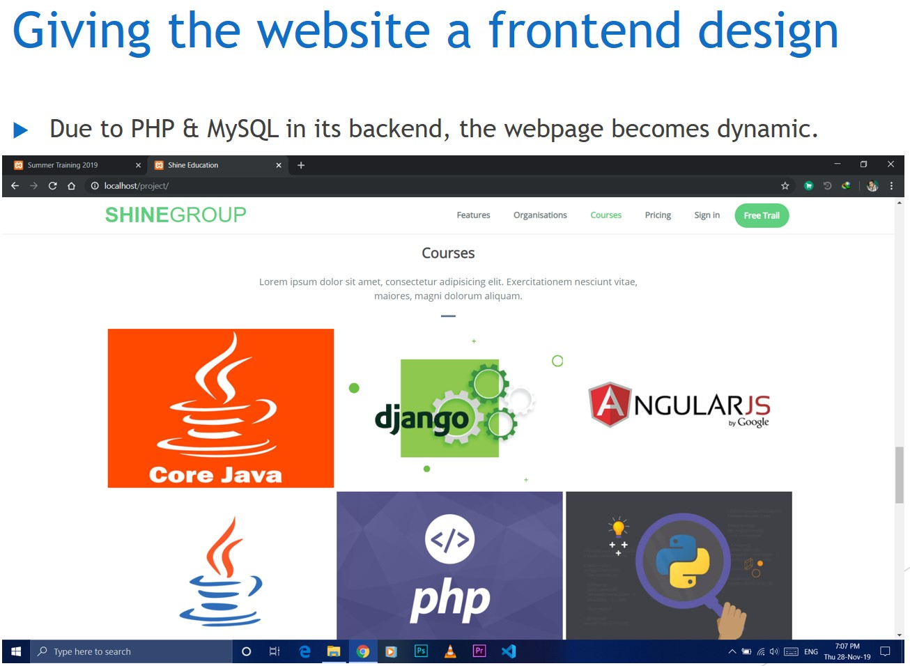
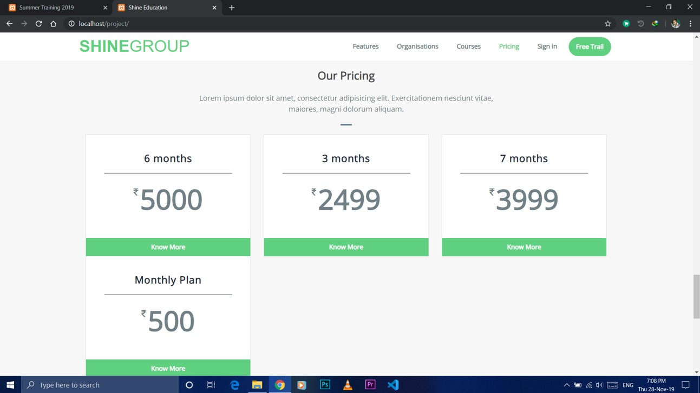
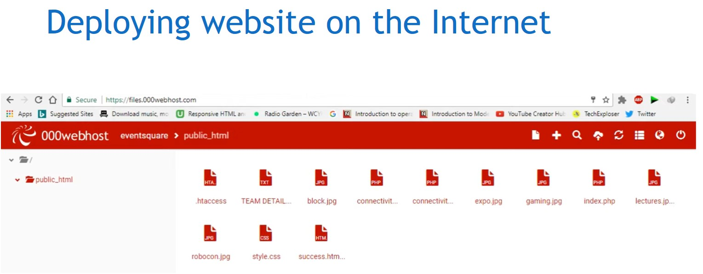

# student-dashboard
A LAMP stack web application which provides login access to students to enroll into different courses with different options on pricing of each course.
Features:
-Student Portal for registering themselves in the coaching institute.
-Selecting desired courses.
-Selecting desired course price according to the duration of each course.
-Adding new courses by the admin.

Database: MySQL
Backend: PHP
Frontend: HTML, CSS, Bootstrap, FontAwesome, Javascript

Screenshots:

  

